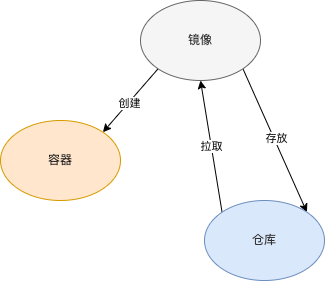

Docker三大核心概念：镜像、容器、仓库

# 镜像
是一个只读的文件和文件夹组合，是Docker容器启动的先决条件

# 容器
是镜像运行实体
容器运行着真正的应用进程
容器有初建、运行、停止、暂停和删除五种状态
在容器内部无法看到主机上的进程、环境变量、网络等信息

# 仓库
镜像仓库用来存储和分发Docker镜像
Docker Hub是官方的公开镜像仓库

# 标准
`OCI`全称为`开放容器标准`（Open Container initiative）
是一个轻量级、开放的治理架构

# Docker 客户端
1. Docker命令是用户与Docker服务端交互的主要方式
2. 使用REST API与Docker服务端交互
3. 各种语言SDK与Docker服务端交互

# Docker 服务端
是Docker所有后台服务的统称
dockerd负责响应和处理来自Docker客户端的请求然后将请求转化为Docker的具体操作

# Docker 重要组件
1. runC   用来运行容器的轻量级工具，是真正用来运行容器的
2. containerd   通过containerd-shim启动并管理runC