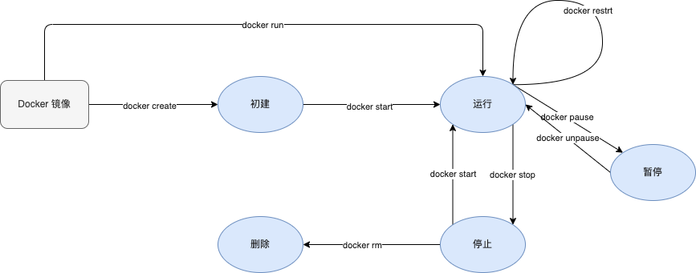

# 容器生命周期



1. 创建并启动容器
   ```
   # 创建
   docker create -it --name=busybox busybox

   # 启动
   docker start # 启动创建好的容器
   docker run # 基于镜像创建容器并启动

   docker run -it --name=busybox busybox
   # 检查本地是否存在busybox镜像
   # 使用busybox镜像创建容器并启动
   # 分配文件系统，并在镜像只读层外创建一个读写层
   # 从Docker IP池中分配一个IP给容器
   # 执行用户的启动命令运行镜像
   # -it 进入交互模式  -t：分配伪终端  -i：打开终端的stdin
   # 进入正在运行容器的终端有两种方式：
   # 1. docker exec -it id /bin/bash  exit退出
   # 2. docker attach id    exit退出会停止容器，使用ctrl+p+q
   ```
2. 停止运行中的容器
   ```
   docker stop [-t|--time[=10]]
   # 该命令向容器发送SIGTERM信号，如果容器内1号进程能够接受并能处理SIGTERM则等待1号进程处理完成后退出，如果等待一段时间后容器依然没有退出，则发送SIGKILL强制终止

   # 使用 docker ps -a 命令查看停止状态的容器信息
   # 终止状态的容器也可以使用 docker start 命令重新启动
   # docker restart 命令会将一个运行中容器终止然后重新启动
   ```
3. 进入容器
   1. docker attach
      使用该命令同时在多个终端运行时，所有窗口同步显示相同内容，当某个窗口阻塞时，其他窗口也不能操作
   2. docker exec
      ```
      docker exec -it busybox sh
      # 每个窗口都是独立的
      ```
4. 删除容器
   ```
   # 删除停止状态的容器
   docker rm busybox

   # 删除正在运行的容器  加 -f (--force)参数
   docker rm -f busybox
   ```
5. 导出容器
   ```
   # 1. 进入容器创建文件
   docker exec -it busybox sh
   cd /tmp && touch test

   # 2. 执行导出命令
   docker export busybox > busybox.tar
   ```
6. 导入容器
   导入其他容器的导出文件实现迁移
   ```
   docker import [OPTIONS] file|URL [REPOSITORY[:TAG]]

   docker import busybox.tar busybox:test
   ```

   